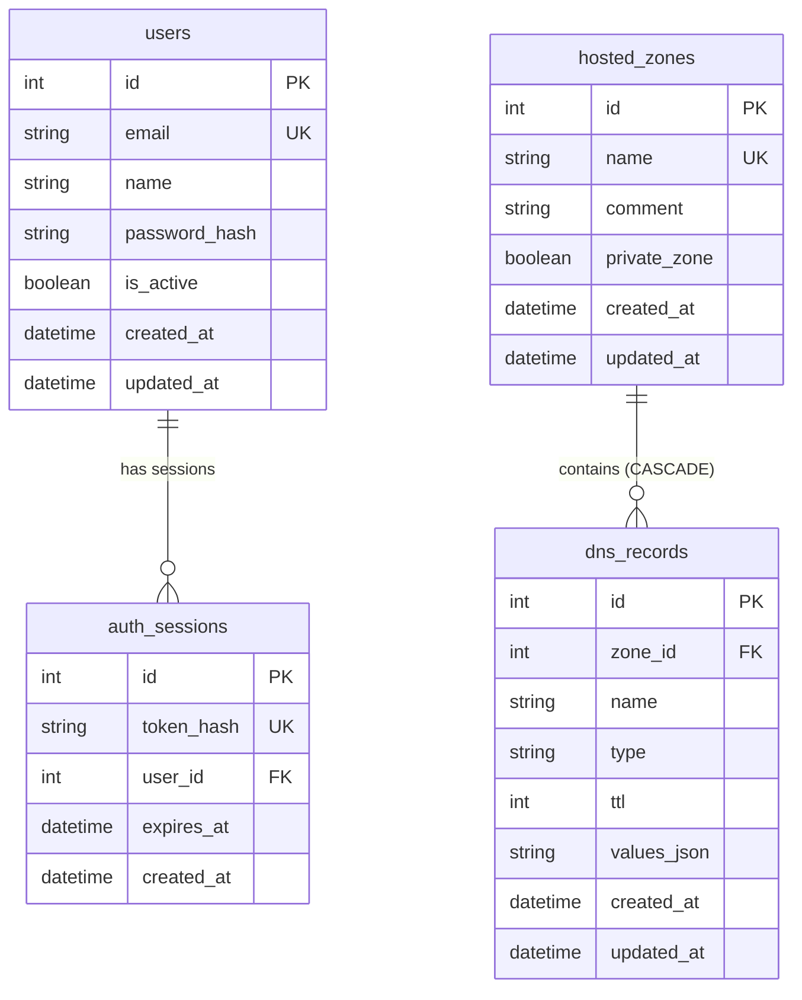

# AWS Route 53 Console Clone

[-000000?style=for-the-badge&logo=nextdotjs&logoColor=white)](https://nextjs.org/)
[](https://www.typescriptlang.org/)
[](https://fastapi.tiangolo.com/)
[](https://www.python.org/)
[](https://www.sqlite.org/)
[](https://www.docker.com/)

A pixel-accurate, full-stack recreation of the **Amazon Web Services (AWS) Route 53** Management Console. Built with **Next.js (TypeScript)**, **FastAPI**, and persistent **SQLite**, this application faithfully mirrors the authentic Route 53 console layout, Cloudscape design system, navigation hierarchy, workflows, and DNS management features.

---

## 🌐 Live Deployment

> **🔗 Production URL**: `https://your-route53-clone.vercel.app` *(Add your deployed Vercel link here)*  
> **API Docs (Swagger UI)**: `https://your-route53-backend.onrender.com/docs` *(or `http://localhost:8000/docs` locally)*

---

## 📸 Key Highlights & Route 53 Experience

- **Authentic AWS Portal & Console Header**: Replicates the exact AWS portal navigation (`https://aws.amazon.com/route53/`) with the official AWS logo (featuring the iconic orange smile arrow), dark utility bar (`🌐 English ⌵`, `Contact us`, `AWS Marketplace`, `Support ⌵`, `My account ⌵`, avatar badge `(S)`), global search `[Alt+S]`, and the floating lavender Route 53 subnav strip (`Overview`, `Hosted zones`, `Health checks`, `Traffic policies`, `Resolver VPCs`, `Profiles`, `Features`, `Pricing`, `Resources`, `FAQs`).
- **Authentic "Get Started" Sign-in Portal**: Replicates the modern AWS auth experience with the official white AWS vector logo, clean "Get started" card, email input, AWS orange `Continue` button, and social sign-in providers (Google, Apple, GitHub, Amazon) alongside seamless 1-click demo access (`admin@example.com` / `route53demo`).
- **Hosted Zone Lifecycle (CRUD)**: Create, inspect, search, filter, paginate, edit, and delete public and private hosted zones with automatic delegation sets (4 AWS authoritative nameservers) and one-click copy.
- **Comprehensive DNS Record Management (CRUD)**: Complete support for all 9 Route 53 DNS record types:
  - `A` (IPv4 address)
  - `AAAA` (IPv6 address)
  - `CNAME` (Canonical name)
  - `TXT` (Text records with quotes handling)
  - `MX` (Mail exchange with priority values)
  - `NS` (Name server records)
  - `PTR` (Pointer records for reverse lookups)
  - `SRV` (Service location with priority/weight/port/target)
  - `CAA` (Certification Authority Authorization)
- **Interactive Console Dashboard**: Route 53 Overview with real metrics (total zones, total records, average TTL), quick actions, and recent zones table.
- **Record Inspector Drawer**: Bottom-anchored inspection panel displaying formatted record values, routing policy, TTL, and copy actions when selecting any record.
- **Bulk Operations (Bonus)**: Multi-row selection checkboxes with indeterminate select-all, bulk deletion of hosted zones and records.
- **BIND Zone File Import & Export (Bonus)**: 
  - RFC-compliant BIND `.zone` file parser with sample template loader and conflict resolution ("Replace existing records" vs "Append").
  - One-click export in standard JSON and BIND format.
- **Keyboard Shortcuts (Bonus)**: Press `Alt+S` or `/` to focus global search, `Alt+C` to create resource, `Esc` to close modals, and `?` for interactive shortcut cheat sheet.
- **Realistic Seed Data**: Automatically pre-seeds 3 production-grade hosted zones (`acme-cloud.com`, `corp.internal`, `staging.acme-dev.net`) and 13 DNS records across all supported types on startup.
- **Simulated AWS Sections**: Dedicated mock consoles for **Health Checks**, **Traffic Policies**, **Resolver VPCs**, and **Route 53 Profiles**, clearly marked with AWS badges and simulated telemetry.

---

## 🏗️ Architecture & Tech Stack

```text
┌────────────────────────────────────────────────────────┐
│                   Next.js 15 Client                    │
│   (React 19, TypeScript, Cloudscape-styled CSS System) │
└───────────────────────────┬────────────────────────────┘
                            │ REST API (JSON)
                            │ Bearer Session Auth
                            ▼
┌────────────────────────────────────────────────────────┐
│                    FastAPI Backend                     │
│      (Python 3.9+, Pydantic V2, PBKDF2 Session Auth)    │
└───────────────────────────┬────────────────────────────┘
                            │ SQLAlchemy 2.0 (ORM)
                            │ Foreign Key Cascades
                            ▼
┌────────────────────────────────────────────────────────┐
│                    SQLite Database                     │
│      (Persistent File Storage / Docker Named Volume)   │
└────────────────────────────────────────────────────────┘
```

| Layer | Technology | Key Libraries |
|---|---|---|
| **Frontend** | Next.js 15 (App Router), React 19, TypeScript | Lucide-react, Vanilla CSS (AWS Cloudscape tokens) |
| **Backend** | FastAPI, Python 3.9+ | Pydantic V2, SQLAlchemy 2, Uvicorn, Passlib (PBKDF2) |
| **Database** | SQLite 3 | WAL mode, foreign key integrity, auto-migrations |
| **DevOps** | Docker, Docker Compose | Multi-stage Dockerfiles, persistent volumes |
| **Testing** | Pytest, FastAPI TestClient | 25 unit & integration tests (100% pass rate) |

---

## 🗄️ Database Schema

The database persists across restarts in `backend/route53_clone.db` (or inside the Docker volume `route53_data`):



---

## 🚀 Quick Start with Docker

The fastest way to test and review the application with persistent storage:

### Prerequisites
- [Docker Desktop](https://www.docker.com/products/docker-desktop/) (running with Compose enabled)

### Run with a single command:
```powershell
docker compose up --build
```

### Access points:
- **Web Console**: [http://localhost:3000](http://localhost:3000)
- **FastAPI Interactive Docs**: [http://localhost:8000/docs](http://localhost:8000/docs)
- **API Health Check**: [http://localhost:8000/api/health](http://localhost:8000/api/health)

### Default Mock Credentials:
| Field | Value |
|---|---|
| **Email** | `admin@example.com` |
| **Password** | `route53demo` |
*(Or simply click **"Use demo credentials"** on the login screen to sign in instantly).*

---

## 💻 Local Development Setup

If you prefer to run the frontend and backend natively without Docker:

### 1. Backend (FastAPI + SQLite)

```powershell
# Navigate to backend directory
cd backend

# Create and activate virtual environment
python -m venv .venv
.\.venv\Scripts\Activate.ps1   # On Linux/macOS: source .venv/bin/activate

# Install dependencies
pip install -r requirements.txt

# Create environment configuration
Copy-Item .env.example .env

# Run FastAPI development server
uvicorn app.main:app --reload --port 8000
```

The database file `backend/route53_clone.db` will be initialized automatically and seeded with sample hosted zones and records.

### 2. Frontend (Next.js + TypeScript)

Open a second terminal window:

```powershell
# Navigate to frontend directory
cd frontend

# Install npm dependencies
npm install

# Configure environment
Copy-Item .env.example .env.local

# Run Next.js Turbopack dev server
npm run dev
```

Open [http://localhost:3000](http://localhost:3000) in your browser.

---

## 🧪 Automated Testing & Verification

The project includes an isolated test suite validating authentication, zone management, record validation across all 9 DNS types, BIND import/export, and cascade deletion.

```powershell
# Backend test suite (Pytest)
cd backend
python -m pytest -v

# Frontend linting & build verification
cd ..\frontend
npm run lint
npm run build
```

**Results:**
- ✅ **25 / 25 Pytest tests passing** (`test_auth.py`, `test_zones.py`, `test_records.py`, `test_import_export.py`)
- ✅ **0 ESLint errors**
- ✅ **Clean static Next.js production build**

---

## 📡 REST API Reference

All protected endpoints accept `Authorization: Bearer <token>`.

### Authentication
| Method | Endpoint | Description |
|---|---|---|
| `POST` | `/api/auth/login` | Login and receive bearer session token |
| `GET` | `/api/auth/me` | Retrieve profile of authenticated user |
| `POST` | `/api/auth/logout` | Revoke session token |

### Hosted Zones
| Method | Endpoint | Description |
|---|---|---|
| `GET` | `/api/hosted-zones` | List, search (`?query=`), filter (`?private_zone=`), paginate |
| `POST` | `/api/hosted-zones` | Create a new public or private hosted zone |
| `GET` | `/api/hosted-zones/{id}` | Retrieve hosted zone details and metadata |
| `PUT` | `/api/hosted-zones/{id}` | Update hosted zone comment / description |
| `DELETE` | `/api/hosted-zones/{id}` | Delete hosted zone and cascade delete records |

### DNS Records
| Method | Endpoint | Description |
|---|---|---|
| `GET` | `/api/hosted-zones/{id}/records` | List, search (`?query=`), filter by type (`?record_type=`) |
| `POST` | `/api/hosted-zones/{id}/records` | Create DNS record (`A`, `AAAA`, `CNAME`, `TXT`, `MX`, etc.) |
| `PUT` | `/api/hosted-zones/{id}/records/{record_id}` | Edit DNS record TTL and values |
| `DELETE` | `/api/hosted-zones/{id}/records/{record_id}` | Delete single DNS record |

### BIND Import & Export
| Method | Endpoint | Description |
|---|---|---|
| `GET` | `/api/hosted-zones/{id}/export/json` | Export hosted zone and records as JSON |
| `GET` | `/api/hosted-zones/{id}/export/bind` | Export hosted zone as RFC-compliant BIND `.zone` file |
| `POST` | `/api/hosted-zones/{id}/import/bind` | Import BIND zone file (supports append or replace) |

---

## ☁️ Deployment Instructions (Vercel & Render)

### Deploy Frontend to Vercel
1. Push your repository to GitHub.
2. Sign in to [Vercel](https://vercel.com/) and click **"Add New Project"**.
3. Select this repository and set the **Root Directory** to `frontend`.
4. Add the Environment Variable:
   - `NEXT_PUBLIC_API_URL` = `https://your-backend-service.onrender.com/api`
5. Click **Deploy**.

### Deploy Backend to Render / Fly.io / Railway
1. Create a new **Web Service** pointing to this repository.
2. Set Root Directory to `backend`.
3. Set Build Command to `pip install -r requirements.txt`.
4. Set Start Command to `uvicorn app.main:app --host 0.0.0.0 --port $PORT`.
5. Attach a persistent disk mounted at `/app/data` and set `DATABASE_URL=sqlite:////app/data/route53_clone.db`.
6. Add `FRONTEND_ORIGINS=https://your-route53-clone.vercel.app` to allow CORS requests.

---

## 📄 License
This project was developed as an assignment clone for educational and demonstration purposes. AWS and Route 53 are trademarks of Amazon Web Services, Inc.
