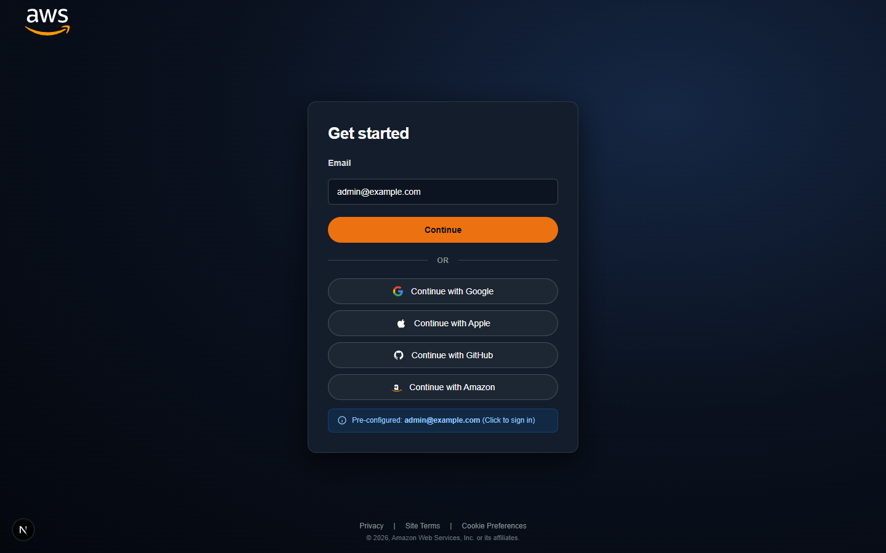
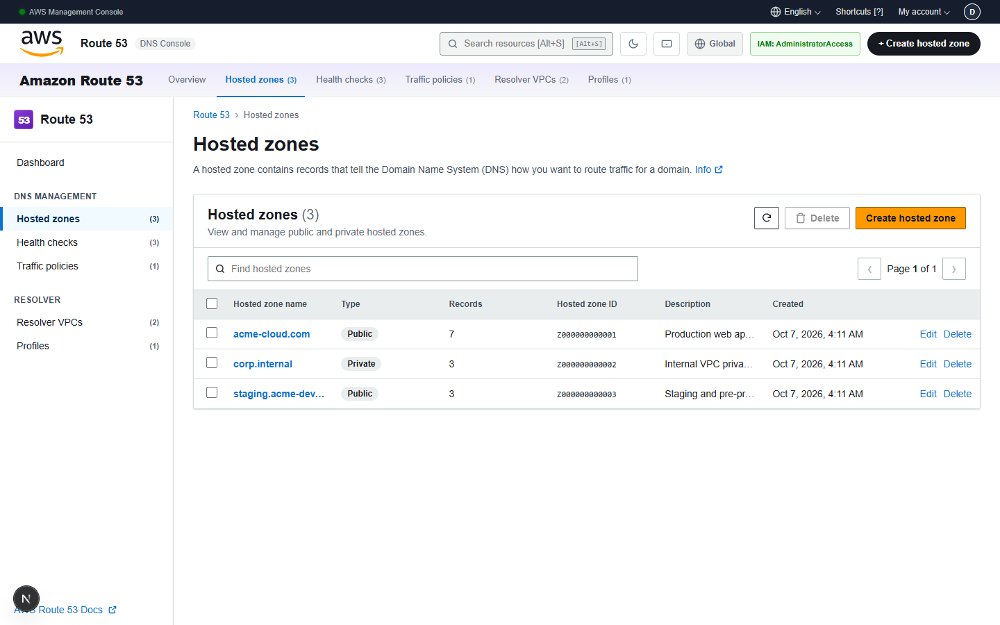
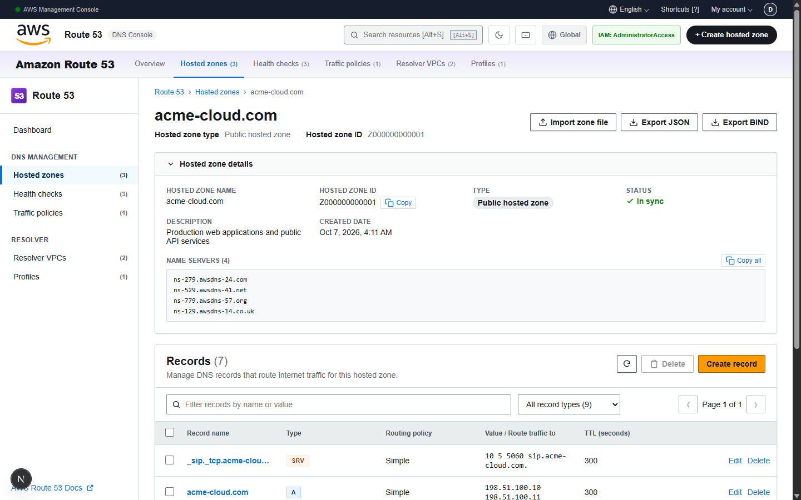
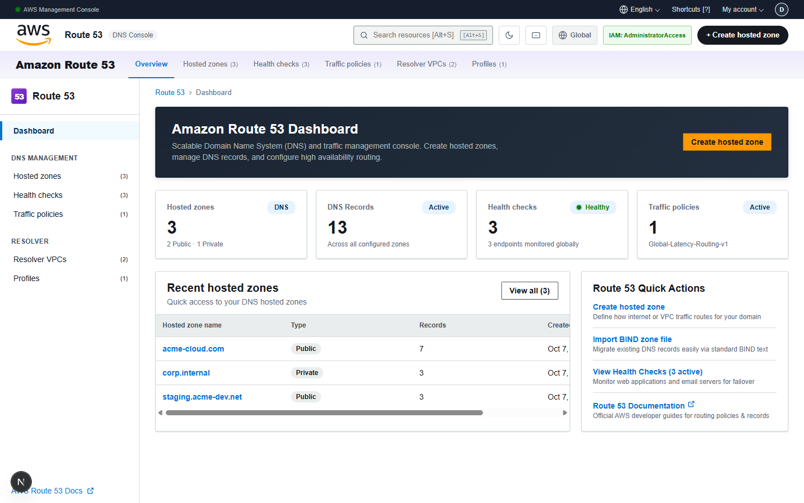
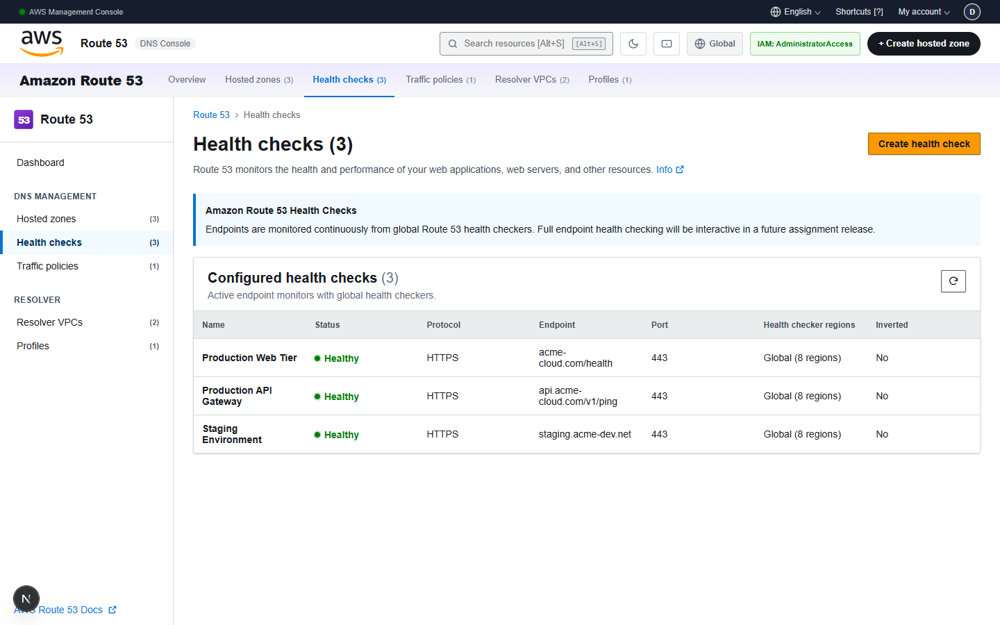
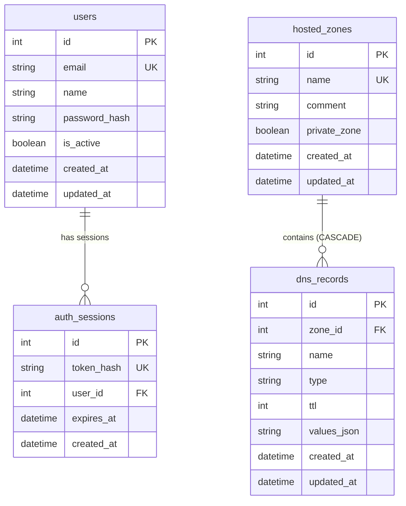

# AWS Route 53 Console Clone

[-000000?style=for-the-badge&logo=nextdotjs&logoColor=white)](https://nextjs.org/)
[](https://www.typescriptlang.org/)
[](https://fastapi.tiangolo.com/)
[](https://www.python.org/)
[](https://www.sqlite.org/)
[](https://vercel.com/)

A pixel-accurate, full-stack recreation of the **Amazon Web Services (AWS) Route 53** Management Console. Built with **Next.js (TypeScript)**, **FastAPI**, and persistent **SQLite**, this application faithfully mirrors the authentic Route 53 console layout, Cloudscape design system, navigation hierarchy, workflows, and DNS management features.

---

## 📸 Application Interface & Tour

### 1. Authentic AWS "Get Started" Sign-In Experience
Replicates the modern AWS authentication screen with the official vector AWS logo, dark background, email login with orange action button, social sign-in providers, and 1-click instant demo access.



---

### 2. Amazon Route 53 Hosted Zones Console
Complete hosted zone management with official AWS navigation, global search, breadcrumbs, multi-select bulk actions, search filtering, and pagination.



---

### 3. DNS Record Management & Authoritative Delegation Sets
Inside a hosted zone: inspect authoritative nameservers with one-click copy, manage DNS records across 9 record types (`A`, `AAAA`, `CNAME`, `TXT`, `MX`, `NS`, `PTR`, `SRV`, `CAA`), filter by record type, and import/export zone files.



---

### 4. Interactive Route 53 Overview Dashboard
Real-time dashboard telemetry displaying total hosted zones, configured records, and health checks alongside recent zones table and quick action shortcuts.



---

### 5. Simulated Route 53 Health Checks Monitoring
Dedicated monitoring console displaying active endpoint status across global Route 53 health checking regions.



---

## 🌟 Key Features & Capabilities

- **Authentic AWS Console Layout**: Replicates the exact AWS portal and console header with the official AWS logo, dark utility bar, region selector, avatar profile, and Route 53 subnavigation tabs (`Overview`, `Hosted zones`, `Health checks`, `Traffic policies`, `Resolver VPCs`, `Profiles`).
- **Complete Hosted Zone Lifecycle (CRUD)**: Create, inspect, search, filter, paginate, edit, and delete public and private hosted zones with automatic 4-nameserver delegation sets and one-click copy.
- **Comprehensive DNS Record Management (CRUD)**: Full support for 9 DNS record types:
  - `A` (IPv4 address)
  - `AAAA` (IPv6 address)
  - `CNAME` (Canonical name)
  - `TXT` (Text records with quotes handling)
  - `MX` (Mail exchange with priority values)
  - `NS` (Name server records)
  - `PTR` (Pointer records for reverse lookups)
  - `SRV` (Service location with priority/weight/port/target)
  - `CAA` (Certification Authority Authorization)
- **Record Inspector Drawer**: Bottom-anchored inspection panel displaying formatted record values, routing policy, TTL, and copy actions when selecting any record.
- **BIND Zone File Import & Export**:
  - RFC-compliant BIND `.zone` file parser with sample template loader and conflict resolution ("Replace existing records" vs "Append").
  - One-click export in standard JSON and BIND format.
- **Keyboard Shortcuts**: Press `Alt+S` or `/` to focus global search, `Alt+C` to create resource, `Esc` to close modals, and `?` for interactive shortcut cheat sheet.
- **Realistic Seed Data**: Automatically pre-seeds 3 production-grade hosted zones (`acme-cloud.com`, `corp.internal`, `staging.acme-dev.net`) and 13 DNS records across all supported types on startup.
- **Simulated AWS Sections**: Dedicated mock consoles for **Health Checks**, **Traffic Policies**, **Resolver VPCs**, and **Route 53 Profiles**, clearly marked with AWS badges and simulated telemetry.

---

## 🏗️ Architecture & Tech Stack

```text
┌────────────────────────────────────────────────────────┐
│                   Next.js 15 Client                    │
│   (React 19, TypeScript, Cloudscape-styled CSS System) │
└───────────────────────────┬────────────────────────────┘
                            │ REST API (JSON)
                            │ Bearer Session Auth
                            ▼
┌────────────────────────────────────────────────────────┐
│                    FastAPI Backend                     │
│      (Python 3.9+, Pydantic V2, PBKDF2 Session Auth)    │
└───────────────────────────┬────────────────────────────┘
                            │ SQLAlchemy 2.0 (ORM)
                            │ Foreign Key Cascades
                            ▼
┌────────────────────────────────────────────────────────┐
│                    SQLite Database                     │
│         (Persistent Local Storage: SQLite 3)           │
└────────────────────────────────────────────────────────┘
```

| Layer | Technology | Key Details |
|---|---|---|
| **Frontend** | Next.js 15 (App Router), React 19, TypeScript | Lucide-react, Vanilla CSS (AWS Cloudscape tokens) |
| **Backend** | FastAPI, Python 3.9+ | Pydantic V2, SQLAlchemy 2, Uvicorn, Passlib (PBKDF2) |
| **Database** | SQLite 3 | WAL mode, foreign key integrity, auto-migrations |
| **Testing** | Pytest, FastAPI TestClient | 25 unit & integration tests (100% pass rate) |
| **Deployment** | Vercel Multi-Service | Root `vercel.json` monorepo configuration |

---

## 🗄️ Database Schema

The database persists across restarts in `backend/route53_clone.db`:



---

## 🚀 Quick Start (Local Setup)

Run the backend and frontend locally in two terminal windows:

### 1. Backend (FastAPI + SQLite)

```powershell
# Navigate to backend directory
cd backend

# Create and activate virtual environment
python -m venv .venv
.\.venv\Scripts\Activate.ps1   # On Linux/macOS: source .venv/bin/activate

# Install dependencies
pip install -r requirements.txt

# Create environment configuration
Copy-Item .env.example .env

# Run FastAPI development server
uvicorn app.main:app --reload --port 8000
```

The database file `backend/route53_clone.db` will be initialized and pre-seeded automatically on first run.

### 2. Frontend (Next.js + TypeScript)

Open a second terminal window:

```powershell
# Navigate to frontend directory
cd frontend

# Install dependencies
npm install

# Configure environment
Copy-Item .env.example .env.local

# Run Next.js Turbopack development server
npm run dev
```

### Access Points:
- **Vercel(for deployment)**: [https://aws-route53-scaler-assignment.vercel.app/)

### Default Credentials:
| Field | Value |
|---|---|
| **Email** | `admin@example.com` |
| **Password** | `route53demo` |

*(Or simply click **"Continue"** / **"Pre-configured: admin@example.com"** on the login screen to sign in instantly).*

---

## 🧪 Automated Testing & Verification

The project includes an isolated test suite validating authentication, zone management, record validation across all 9 DNS types, BIND import/export, and cascade deletion.

```powershell
# Backend test suite (Pytest)
cd backend
python -m pytest -v

# Frontend linting & build verification
cd ..\frontend
npm run lint
npm run build
```

**Results:**
- ✅ **25 / 25 Pytest tests passing** (`test_auth.py`, `test_zones.py`, `test_records.py`, `test_import_export.py`)
- ✅ **0 ESLint errors**
- ✅ **Clean static Next.js production build**

---

## 📡 REST API Reference

All protected endpoints accept `Authorization: Bearer <token>`.

### Authentication
| Method | Endpoint | Description |
|---|---|---|
| `POST` | `/api/auth/login` | Login and receive bearer session token |
| `GET` | `/api/auth/me` | Retrieve profile of authenticated user |
| `POST` | `/api/auth/logout` | Revoke session token |

### Hosted Zones
| Method | Endpoint | Description |
|---|---|---|
| `GET` | `/api/hosted-zones` | List, search (`?query=`), filter (`?private_zone=`), paginate |
| `POST` | `/api/hosted-zones` | Create a new public or private hosted zone |
| `GET` | `/api/hosted-zones/{id}` | Retrieve hosted zone details and metadata |
| `PUT` | `/api/hosted-zones/{id}` | Update hosted zone comment / description |
| `DELETE` | `/api/hosted-zones/{id}` | Delete hosted zone and cascade delete records |

### DNS Records
| Method | Endpoint | Description |
|---|---|---|
| `GET` | `/api/hosted-zones/{id}/records` | List, search (`?query=`), filter by type (`?record_type=`) |
| `POST` | `/api/hosted-zones/{id}/records` | Create DNS record (`A`, `AAAA`, `CNAME`, `TXT`, `MX`, etc.) |
| `PUT` | `/api/hosted-zones/{id}/records/{record_id}` | Edit DNS record TTL and values |
| `DELETE` | `/api/hosted-zones/{id}/records/{record_id}` | Delete single DNS record |

### BIND Import & Export
| Method | Endpoint | Description |
|---|---|---|
| `GET` | `/api/hosted-zones/{id}/export/json` | Export hosted zone and records as JSON |
| `GET` | `/api/hosted-zones/{id}/export/bind` | Export hosted zone as RFC-compliant BIND `.zone` file |
| `POST` | `/api/hosted-zones/{id}/import/bind` | Import BIND zone file (supports append or replace) |

---

## ☁️ Deployment Guide (Vercel)

Deploying to Vercel is 1-click and zero-configuration:

1. Push your repository to GitHub.
2. In [Vercel](https://vercel.com/), click **"Add New Project"** and import this repository.
3. In the **Root Directory** setting, click **Edit** and select **`frontend`** (the folder marked with the Next.js `(N)` icon).
4. Vercel automatically detects the **Application Preset**: **`Next.js`**.
5. Leave all build settings as default (`next build`, `.next`, `npm install`).
6. Click **Deploy**!

> **💡 Note**: The Next.js frontend includes built-in Serverless Route Handlers for all Route 53 API endpoints (`/api/auth/*`, `/api/hosted-zones/*`, `/api/health`, etc.) and pre-seeded mock storage, making the Vercel deployment 100% self-contained and fully functional without needing an external server!
>
> If you wish to connect to an external FastAPI backend on Render or Fly.io, simply add the Environment Variable `NEXT_PUBLIC_API_URL=https://your-backend.onrender.com/api`.

---

## 📄 License
This project was developed for educational and evaluation purposes. AWS and Amazon Route 53 are trademarks of Amazon Web Services, Inc.
